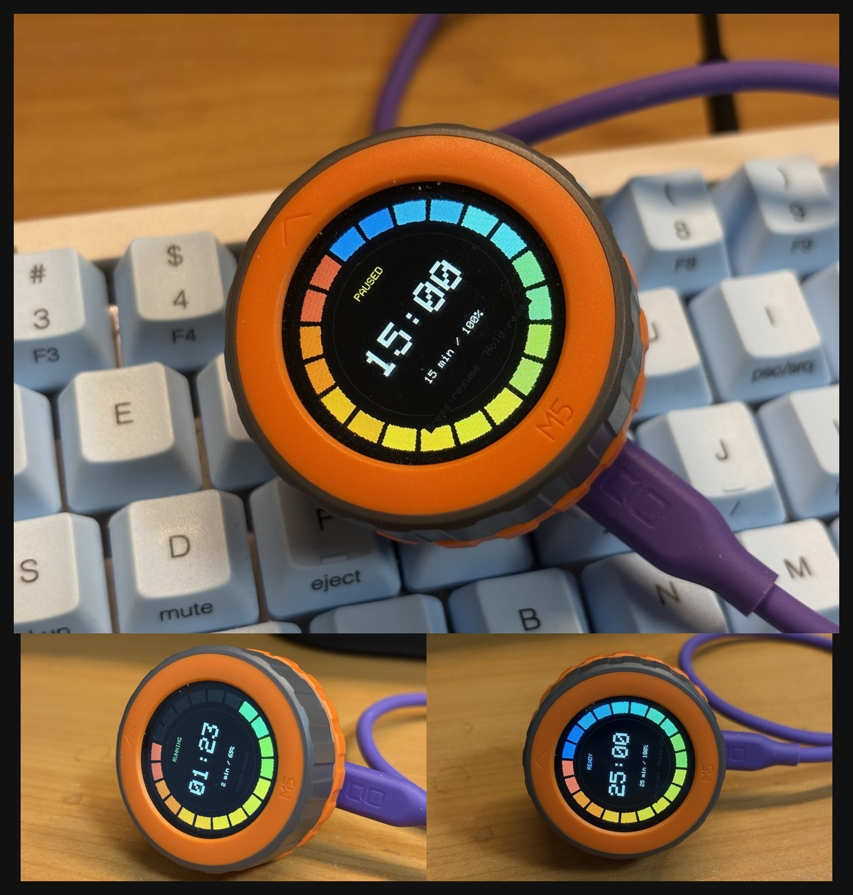

# M5DIAL Color CountDown Timer

M5Dial 向けの視覚重視カウントダウンタイマーです。

## 写真

## 主な機能

- リング表示タイマー（20セグメント）
- エンコーダ高速回転対応（まとめて分数変更）
- 取りこぼし補正付き 1 秒進行（処理遅延時も追従）
- 半分経過通知（音パターン切替）
- 完了時 3 連アラーム（ノンブロッキング）
- DONE 状態の自動減光（任意）
- DONE 状態の自動リセット（任意）
- READY 長押しミュート切替
- 最終設定時間の NVS 保存・起動時復元
- プリセット刻み（5/15/25/50 分）

## 操作

- 回転: 時間設定（READY/PAUSED）
- 短押し:
	- READY -> 開始
	- RUNNING -> 一時停止
	- PAUSED -> 再開
	- DONE -> リセット
- 長押し:
	- READY -> ミュート切替（`ENABLE_LONG_PRESS_MUTE_TOGGLE` が有効時）
	- READY 以外 -> リセット

## 設定

設定は [config.h](config.h) で変更できます。主な項目:

- `HALF_NOTIFY_PATTERN`
- `USE_PRESET_STEPS`
- `PERSIST_LAST_DURATION`
- `MUTE_MODE_DEFAULT`
- `DONE_DIM_START_MS`, `DONE_DIM_EVERY_MS`, `DONE_DIM_STEP`, `DONE_MIN_BRIGHTNESS`
- `DONE_AUTO_RESET_MS`

## config.example.h の使い方

配布や再利用時は、次の運用が推奨です。

1. [config.example.h](config.example.h) をコピーして [config.h](config.h) を作る
2. [config.h](config.h) を環境に合わせて編集する
3. [config.h](config.h) は必要に応じてバージョン管理対象外にする

## ライセンス

このプロジェクトは MIT ライセンスです。

- Copyright: 2026 omiya-bonsai
- 詳細: [LICENSE](LICENSE)
